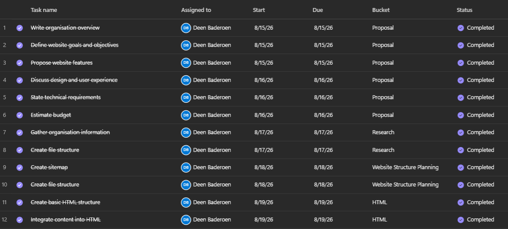
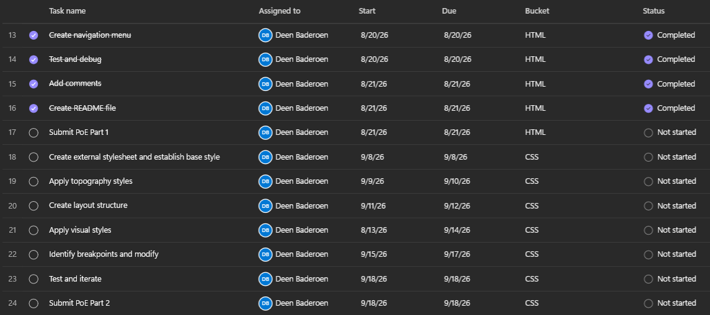
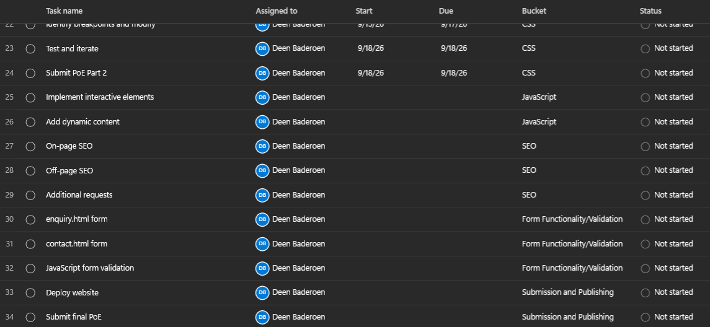

# Vision Security Systems Website

**By ST10500824 (Deen Baderoen)**

## Project Overview

This project aims to create a fully functioning website using HTML, CSS and JavaScript for the security company Vision Security Systems, a security installations company based in Somerset West, South Africa.

Vision Security Systems is a highly acclaimed, independently-owned business that doesn't let their customers down. However, they currently lack an online presence in the form of a website. This project will solve this issue through the development of a fully fledged website for Vision Security Systems.

The website will consist of multiple pages that showcase their services, give more information, allow users to send enquiries, and provide ways for keen users to contact the business.

This project should be completed by the 2nd of November 2026.

## Website Goals and Objectives

The main goal of this website is to provide an accessible and easy-to-navigate space that explains and showcases what Vision Security Systems does, what it offers as a company, and how and where you can contact them. I am making this website in hopes of achieving a greater online presence for the company. Vision Security Systems wishes for more exposure and, thus, more interested customers.

## Target Audience

- People with property in the Helderberg area (Strand, Gordon’s Bay, Somerset West, Macassar, Sir Lowry’s Pass).
- People with property in Cape Town, Stellenbosch and the surroundin winelands.
- Those in need of any security installations for their home/business.
- Those in need of security system repairs or upgrades for their home/business.
- Anyone looking for quality and efficient service.

## Key Features and Functionality

The website currently consists of six pages:

**Homepage**: Includes the hero image, a brief overview of the organisation and a call to action to view the services offered and to contact the organisation.

**About Us**: Displays a lengthier description of the organisation’s history, mission, and goals.

**Services**: Showcases and explains every service the organisation offers.

**Enquiry**: Includes a form for enquiries regarding the organisation. Also includes a Frequently Asked Questions (FAQ) section.

**Contact**: Consists of contact information (email, phone number, WhatsApp, address).

## Technical Implementation

- HTML5 for content and structure.
- CSS for styling and design.
- JavaScript for interactivity.
- VS Code as the IDE used for development.
- Git and GitHub used for version control.

## Timeline and Milestones

## Part 1 Details

### Consists of

- Two short website proposals.
- A full website proposal of chosen organisation.
- Research relating to the chosen organisation.
- The basic structure and content of the website written in HTML.

## Sitemap

The main page is the **index page**. All pages can be accessed from any page via the navigation bar.

### Index Page

- Hero image and heading.
- Brief organisation overview.
- Preview of some services provided.
- Call to action banner.

### About Page

- Page heading.
- Description of company.
- Mission and vision.
- Call to action banner.

### Services Page

- Page heading.
- List of services provided.
- Call to action banner.

### Enquiry Page

- Page heading.
- Form.
- FAQ.

### Contact Page

- Page heading.
- Contact details.
- Physical address and operating hours.
- Call to action banner.

## Changelog

See [CHANGELOG.md](CHANGELOG.md) detailed version history and changes made.

## References

Afrihost, 2026. Hosting. \[Online] Available at: https://www.afrihost.com \[Accessed 20 August 2026].

Baderoen, E., 2026. Owner of Vision Security Systems. Interviewed by Deen Baderoen. \[Personal interview], 15 August 2026, 17:30.

Pixabay, n.d. Images. [Online]. Available at: https://www.pixabay.com. [Accessed 20 August 2026].

Unsplash, n.d. Images. [Online]. Available at: https://www.unsplash.com. [Accessed 20 August 2026].
Wireframes created in Microsoft PowerPoint.

Timeline created in Microsoft Planner.

